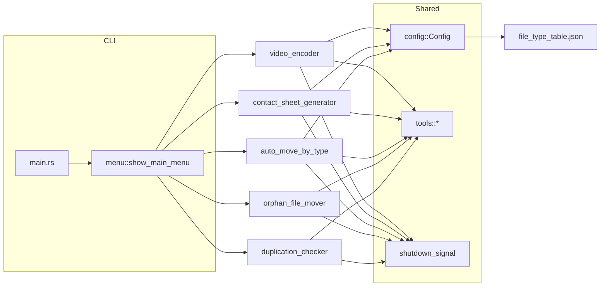

# Auto Video Organize

一個以 Rust 撰寫的互動式 CLI 工具，整合「影片重新編碼、去重、預覽圖生成、依類型整理、孤立檔案清理」等功能，專注於大量影音/混合檔案的整理與批次處理。

## 功能概覽

- 影片重新編碼：掃描影片後以 ffmpeg 轉為 HEVC/x265（10-bit）+ FLAC 音訊，失敗檔案移至 `fail/`。
- 資料分析紀錄與去重：以檔案大小 + BLAKE3 雜湊判斷重複檔案，並移動至 `duplication_file/`，同時維護 `.hash_table.json`。
- 影片預覽圖生成：ffprobe 取資訊 + ffmpeg scdet 場景偵測 + 54 張縮圖拼接為聯絡表（9x6）。
- 自動依類型整理檔案：依副檔名分類至 `video/ audio/ image/ ...` 等資料夾。
- 移動孤立檔案：以檔名（不含副檔名）分組，僅有單一檔案的群組視為孤立檔案並移動至 `orphan_files/`。

## 架構圖（Mermaid）



## 流程圖（Mermaid）

```mermaid
flowchart TD
    start([啟動]) --> init[init::init / 日誌初始化]
    init --> menu{主選單}

    menu -->|影片重新編碼| encode[掃描影片 -> 任務排程 -> ffmpeg]
    menu -->|資料分析紀錄與去重| dedup[掃描檔案 -> BLAKE3 -> 移動重複檔案]
    menu -->|影片預覽圖生成| sheet[ffprobe -> scdet -> 選點 -> 擷取 -> 合併]
    menu -->|自動依類型整理| classify[掃描檔案 -> 分類 -> 移動]
    menu -->|移動孤立檔案| orphan[同名分組 -> 孤立檔案 -> 移動]
    menu -->|離開| end([結束])

    encode --> menu
    dedup --> menu
    sheet --> menu
    classify --> menu
    orphan --> menu
```

## 系統需求

- Rust 2024 Edition（`cargo`）
- ffmpeg / ffprobe 可在 PATH 中呼叫

## 安裝與執行

```bash
cargo build --release
cargo run
```

程式為互動式選單，依提示輸入目錄路徑即可。

可透過 `RUST_LOG` 調整日誌等級，例如：

```bash
RUST_LOG=debug cargo run
```

## 輸出與檔案變更

| 功能 | 輸出/變更 | 備註 |
| --- | --- | --- |
| 影片重新編碼 | 產生 `*.convert.mkv` | 失敗檔案移至 `fail/`，中斷時會刪除未完成輸出 |
| 去重 | `.hash_table.json` + `duplication_file/` | 重複檔案會移動並避免同名衝突 |
| 預覽圖生成 | `_contact_sheets/*_contact_sheet.jpg` | 產生暫存 `.tmp_*` 目錄後會清理 |
| 依類型整理 | `video/ audio/ image/ ... other/` | 依 `file_type_table.json` 分類 |
| 孤立檔案 | `orphan_files/` | 只掃描指定資料夾第一層（不遞迴） |

## 設定檔

- `src/data/file_type_table.json`：副檔名分類表。修改後需重新建置。
- 目前設定檔載入路徑是編譯期 `CARGO_MANIFEST_DIR`，請確保該路徑存在並包含 `src/data`。

## 範例程式

### 互動式執行範例

```text
$ cargo run
=== 自動影片整理系統 ===
請選擇功能 > 影片預覽圖生成
請輸入影片資料夾路徑: /media/videos
預覽圖將輸出至: /media/videos/_contact_sheets
掃描影片檔案中...
找到 3 個影片檔案，依檔案大小排序（由小到大）
開始平行生成預覽圖（使用 8 個執行緒）...
...（進度略）
=== 預覽圖生成摘要 ===
  總計: 3 個影片
  成功: 3 個
```

### 以函式庫方式使用（檔案分類範例）

```rust
use auto_video_organize::component::auto_move_by_type::FileCategorizer;
use auto_video_organize::config::Config;
use std::path::Path;
use std::sync::{Arc, atomic::AtomicBool};

fn main() -> anyhow::Result<()> {
    let config = Config::new()?;
    let shutdown = Arc::new(AtomicBool::new(false));
    let categorizer = FileCategorizer::new(config.file_type_table, shutdown);

    let target = Path::new("/path/to/folder");
    let files = categorizer.scan_and_categorize(target)?;
    let result = categorizer.move_files_to_categories(&files, target)?;

    println!("移動 {} 個檔案", result.files_moved);
    Ok(())
}
```

## 測試

```bash
cargo test
```

整合測試與 E2E 測試會讀寫 `/tmp` 下的測試資料，且部分流程需要 ffmpeg/ffprobe。

## 注意事項

- 影片預覽圖與重新編碼會大量使用 CPU，請確保有足夠資源。
- 檔案移動以 `rename` 為主，跨檔案系統時會改為「複製後刪除」。
- 掃描行為：
  - 依類型整理/去重/預覽圖使用遞迴掃描（WalkDir）。
  - 孤立檔案僅掃描第一層檔案（不含子資料夾）。
