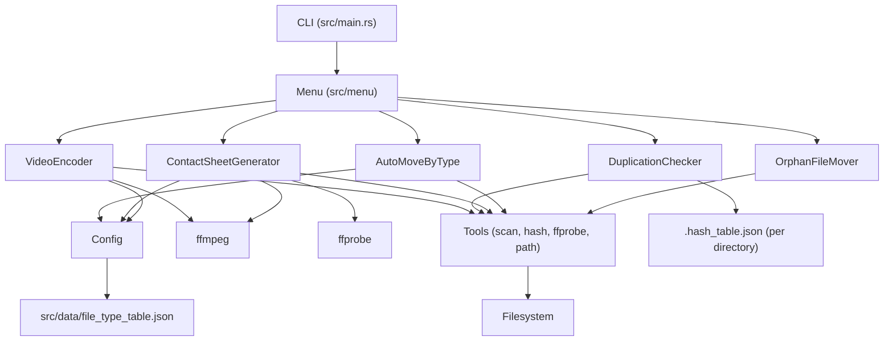
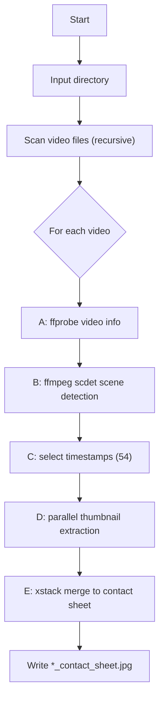

# Auto Video Organize

Auto Video Organize is a Rust CLI for organizing video libraries and mixed media directories. It provides five workflows: video re-encode, duplicate detection, contact sheet generation, auto move by file type, and orphan file cleanup. The prompts are currently in Chinese, but the behaviors below are language-agnostic.

## Features
- Video re-encode to HEVC/x265 with FLAC audio using ffmpeg, with CPU-aware concurrency and failure isolation.
- Duplicate detection by size plus BLAKE3 hash, with a persistent hash table per directory and duplicates moved to `duplication_file/`.
- Contact sheet generation using ffprobe and scdet, 54 thumbnails (9x6 grid), output to `_contact_sheets/`.
- Auto move by type using `file_type_table.json` extension rules, with category folders and an `other/` fallback.
- Orphan file mover for top-level unmatched stems, moved into `orphan_files/`.

## Requirements
- Rust toolchain (edition 2024)
- `ffmpeg` and `ffprobe` on PATH (required for video encoding and contact sheets)
- Read/write access to the target directories

## Quick Start
```bash
cargo run
```

Select a workflow in the menu and provide the target directory path when prompted.

## Example: contact sheet programmatically
```rust
use auto_video_organize::component::contact_sheet_generator::{
    create_contact_sheet, create_thumbnail_tasks, detect_scenes, extract_thumbnails_parallel,
    select_timestamps, DEFAULT_GRID_COLS, DEFAULT_GRID_ROWS, DEFAULT_THUMBNAIL_COUNT,
};
use auto_video_organize::tools::{ensure_directory_exists, get_video_info};
use std::path::Path;
use std::sync::{Arc, atomic::AtomicBool};

fn main() -> anyhow::Result<()> {
    let video_path = Path::new("/path/to/video.mp4");
    let output_dir = Path::new("/path/to/_contact_sheets");
    ensure_directory_exists(output_dir)?;

    let info = get_video_info(video_path)?;
    let scenes = detect_scenes(video_path, &info, None)?;
    let timestamps = select_timestamps(info.duration_seconds, &scenes, DEFAULT_THUMBNAIL_COUNT);

    let tasks = create_thumbnail_tasks(video_path, &timestamps, output_dir);
    let shutdown = Arc::new(AtomicBool::new(false));
    let results = extract_thumbnails_parallel(tasks, &shutdown);

    let mut thumbnails: Vec<_> = results
        .into_iter()
        .filter(|r| r.success)
        .map(|r| r.output_path)
        .collect();
    thumbnails.sort();

    let output_path = output_dir.join("video_contact_sheet.jpg");
    create_contact_sheet(&thumbnails, &output_path, DEFAULT_GRID_COLS, DEFAULT_GRID_ROWS)?;
    Ok(())
}
```

## Architecture


## Flow: Contact Sheet Pipeline


## Components and behavior
- VideoEncoder
  - Recursively scans for video files.
  - Creates `.convert.mkv` outputs beside the source file.
  - Uses an adaptive scheduler that spawns new ffmpeg tasks while CPU usage is below 95 percent.
  - On failure, removes partial output and moves the source file to `fail/`.

- DuplicationChecker
  - Recursively scans all files in the directory.
  - Uses file size as a prefilter, then BLAKE3 hash for exact match.
  - Persists a `.hash_table.json` in the target directory.
  - Moves duplicates into `duplication_file/` with name conflict suffixes.

- ContactSheetGenerator
  - Recursively scans for video files and writes output to `_contact_sheets/`.
  - Five-stage pipeline (info, scene detect, timestamps, thumbnails, merge).
  - Default grid is 9x6 (54 thumbnails) at 320x180 per tile.
  - Uses a temporary per-video folder and cleans it after completion.

- AutoMoveByType
  - Recursively scans all files except existing category folders.
  - Categorizes by extension using `file_type_table.json`.
  - Moves files into folders such as `video/`, `audio/`, `image/`, and `other/`.

- OrphanFileMover
  - Scans only the top-level directory (no recursion).
  - Groups files by stem; groups with a single file are treated as orphans.
  - Moves orphans into `orphan_files/`.

## Configuration
- `src/data/file_type_table.json` controls extension-to-category mapping.
- Categories map to folders: `video`, `audio`, `image`, `archive`, `document`, `spreadsheet`, `presentation`, `ebook`, `code`, `markup`, `database`, `executable`, `font`, `cad_3d`, `system`, `other`.

## Output directories
- `fail/` - original files that failed re-encoding.
- `duplication_file/` - files identified as duplicates.
- `_contact_sheets/` - generated contact sheets.
- `orphan_files/` - files without matching stems.
- `<category>/` - auto-move targets (see Configuration).

## Logging and shutdown
- Logging uses `env_logger` and respects `RUST_LOG`.
- Ctrl-C sets a shutdown flag; long-running tasks check it and stop gracefully.

## Testing
```bash
cargo test
```

Integration and E2E tests rely on ffmpeg or ffprobe and test data under `/tmp`.
